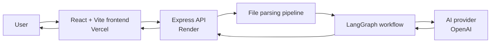
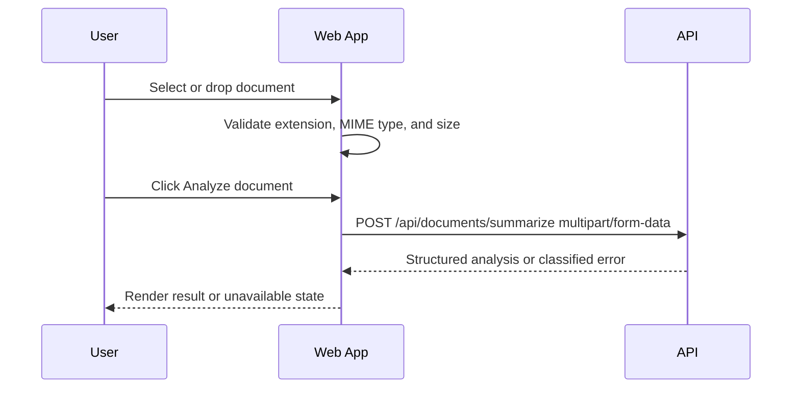
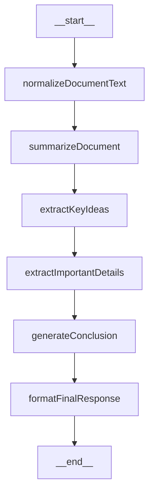
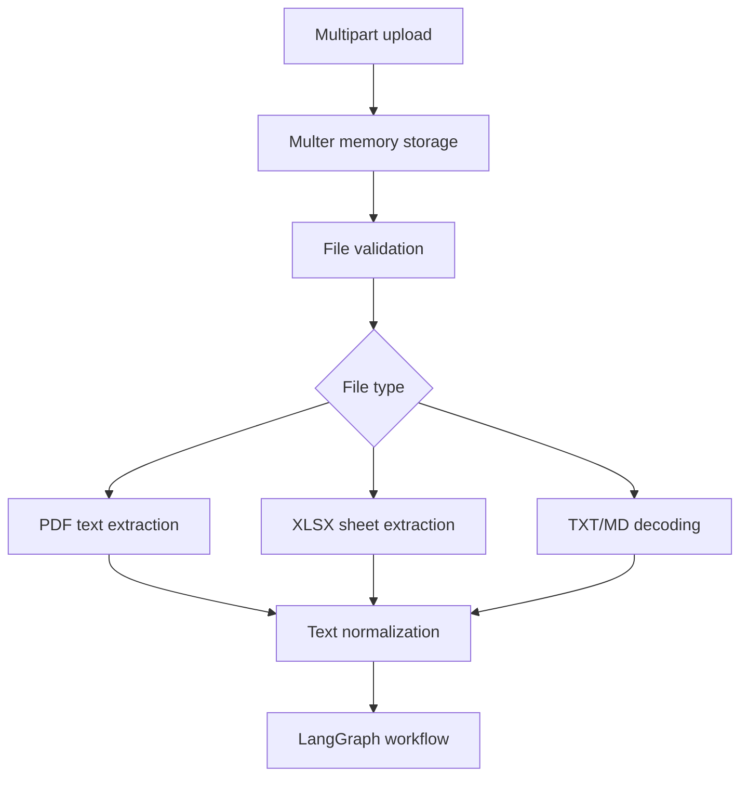
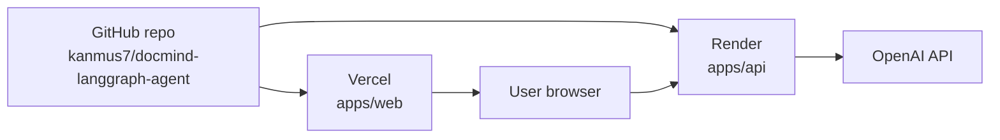
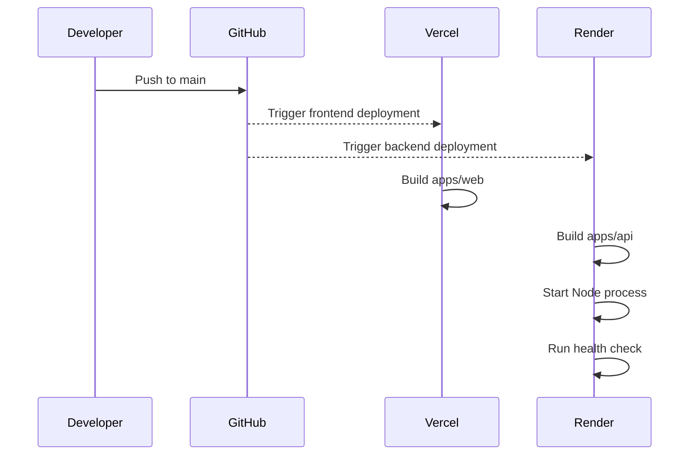

# DocMind Technical Architecture

## 1. Executive Overview

DocMind is an experimental fullstack AI application for document analysis. It allows a user to upload a document and receive a structured analysis containing a summary, key ideas, important details, a conclusion, and warnings when applicable.

The project exists to learn and validate practical AI application architecture beyond a single prompt call. It focuses on:

- LangGraph workflow orchestration
- LangChain provider integration
- document parsing and normalization
- structured LLM responses
- frontend/backend separation
- production deployment with Vercel and Render
- operational failure handling for AI providers

DocMind solves a common knowledge-work problem: extracting useful information from documents quickly while preserving a clear and structured output contract. Instead of returning raw model text, the backend asks the AI provider for typed fields that the frontend can render predictably.

LangGraph was chosen because document analysis is naturally a workflow. The application does not only ask one question; it performs multiple ordered steps:

1. normalize document text
2. summarize the content
3. extract key ideas
4. extract important details
5. generate a conclusion
6. validate the final response

This makes DocMind a useful learning project for production AI systems. Real AI applications require orchestration, validation, observability, provider failure handling, environment management, cost awareness, and deployment discipline. These concerns are different from traditional CRUD applications because the main dependency is probabilistic, remote, metered, and failure-prone.

## 2. High-Level Architecture

DocMind uses a separated frontend/backend architecture:



The request flow is:

```text
User -> Frontend -> Backend API -> LangGraph workflow -> AI Provider -> Structured response
```

### Frontend Responsibilities

- Presents the document upload interface.
- Validates basic file type and file size before upload.
- Sends the document as multipart form data.
- Reads `VITE_API_BASE_URL` to locate the backend.
- Displays loading, validation, provider error, and success states.
- Renders structured fields returned by the API.
- Runs as a static Vite build deployed to Vercel.

### Backend Responsibilities

- Exposes HTTP endpoints through Express.
- Handles CORS for local and production origins.
- Accepts multipart uploads with Multer.
- Validates uploaded files.
- Extracts readable text from supported file types.
- Runs the LangGraph document workflow.
- Integrates with the AI provider through LangChain.
- Classifies provider errors safely.
- Prevents stack traces and secrets from leaking in production responses.
- Runs as a Node.js service deployed to Render.

### LangGraph Responsibilities

- Defines the AI workflow as a state graph.
- Passes state between workflow nodes.
- Splits analysis into explicit steps.
- Makes the pipeline easier to inspect, extend, and test.
- Produces a final structured response validated with Zod.

### AI Provider Responsibilities

- Performs language understanding and generation.
- Produces structured summaries, ideas, details, and conclusions.
- Enforces model access, billing, quota, rate limits, and request constraints.

## 3. Frontend Architecture

The frontend is a React application built with Vite and TypeScript. It lives in `apps/web`.

Core files:

- `apps/web/src/App.tsx`
- `apps/web/src/main.tsx`
- `apps/web/src/index.css`
- `apps/web/package.json`
- `apps/web/vite.config.ts`

The app uses React state to manage:

- selected file
- analysis result
- generic frontend errors
- structured backend provider errors
- loading state
- drag/drop state

### Vite Setup

Vite provides local development, TypeScript integration, and production bundling. The production output is written to `dist`, which is the Vercel output directory.

Vercel configuration:

```text
Root directory: apps/web
Install command: npm install
Build command: npm run build
Output directory: dist
```

### Environment Variables

The frontend uses one public runtime build variable:

```text
VITE_API_BASE_URL=https://docmind-api-aat4.onrender.com
```

Only `VITE_` variables are exposed to the browser by Vite. No backend secrets are allowed in Vercel frontend variables.

The frontend calls:

```ts
fetch(`${apiBaseUrl}/api/documents/summarize`, {
  method: "POST",
  body
});
```

### Upload Flow



The frontend validates:

- allowed extensions: PDF, XLSX, XLS, TXT, MD
- maximum upload size: 10 MB
- missing frontend API URL

### Loading and Error Handling

The frontend distinguishes two error classes:

- generic errors, such as missing `VITE_API_BASE_URL`
- structured provider errors returned by the backend

Provider errors render an explicit degraded-mode UI:

```text
AI analysis unavailable
AI analysis is unavailable right now.
<provider-safe-message>
<recommended action>
```

The frontend does not render fake analysis results when the backend reports an AI provider failure.

### Responsive Design

Tailwind CSS is used for layout, spacing, typography, and responsive behavior. The interface uses a two-column layout on larger screens and a stacked layout on smaller screens. The upload panel, result panel, and error states are designed to fit both desktop and mobile viewports.

## 4. Backend Architecture

The backend is a Node.js, Express, and TypeScript API deployed to Render. It lives in `apps/api`.

Core files:

- `apps/api/src/server.ts`
- `apps/api/src/app.ts`
- `apps/api/src/parser.ts`
- `apps/api/src/fileValidation.ts`
- `apps/api/src/analyzer.ts`
- `apps/api/src/openaiClient.ts`
- `apps/api/src/providerErrors.ts`
- `apps/api/src/aiSmoke.ts`

### Express Server

The Express app is created in `createApp()`. The server binds to `process.env.PORT`, which is required by Render.

The API exposes:

```text
GET  /health
GET  /health/config
GET  /api/ai/smoke-test
POST /api/documents/summarize
```

### Middleware

The backend uses:

- `cors` for browser access control
- `express.json()` for JSON request bodies
- `multer` with memory storage for uploaded files

CORS allows local development origins by default:

```text
http://localhost:5173
http://127.0.0.1:5173
```

In production, Render should set:

```text
CORS_ORIGIN=https://docmind-langgraph-agent-web.vercel.app
```

### File Upload Handling

Uploads use Multer memory storage:

```ts
const upload = multer({
  storage: multer.memoryStorage(),
  limits: { fileSize: maxUploadBytes }
});
```

The API accepts a single multipart field:

```text
document
```

The upload route:

1. checks that a file exists
2. validates type and size
3. extracts text
4. rejects empty extracted text
5. runs the LangGraph workflow
6. returns structured JSON

### Validation

Validation protects the API from unsupported or unexpectedly large inputs. Shared constraints are kept in `packages/shared` so the frontend and backend use the same limits.

Current restrictions:

- supported file types: PDF, XLSX/XLS, TXT, Markdown
- maximum size: 10 MB

### Parsing Layer

The parser converts files into raw text before the AI workflow runs:

- PDF files are parsed using `pdf-parse`.
- XLSX/XLS files are parsed using `xlsx`.
- TXT and Markdown files are decoded as text.

The parser is deliberately separated from the analyzer. This keeps deterministic file processing isolated from probabilistic AI analysis.

### Provider Integration

OpenAI integration is centralized in `openaiClient.ts`:

```ts
export function createOpenAIChatModel() {
  return new ChatOpenAI({
    apiKey: process.env.OPENAI_API_KEY,
    model: process.env.OPENAI_MODEL ?? "gpt-5.5"
  });
}
```

This creates a single point for future provider configuration changes.

### Error Handling

The backend has explicit handling for:

- Multer upload size errors
- application validation errors
- provider errors
- generic unknown errors

Provider errors are classified into safe application-level codes:

- `missing_api_key`
- `invalid_api_key`
- `insufficient_quota`
- `rate_limited`
- `billing_required`
- `model_not_found`
- `model_configuration_error`
- `unknown_provider_error`

Responses do not include stack traces, raw provider payloads, or secrets.

## 5. LangGraph Architecture

LangGraph is a workflow orchestration library for stateful AI applications. It allows an application to model an AI process as a graph of nodes, where each node receives state, performs work, and returns state updates.

This is useful because many AI tasks are not a single request. They are pipelines with intermediate state, branching, retries, validation, tool calls, memory, or multiple model interactions.

### Core Concepts

| Concept | Meaning in DocMind |
| --- | --- |
| State | Shared document analysis data passed through the workflow |
| Node | A named step such as summarization or detail extraction |
| Edge | A transition from one node to the next |
| State propagation | Each node adds or updates fields used by later nodes |
| Final output | A validated structured response returned to the API |

DocMind defines graph state with LangGraph annotations:

```ts
const GraphState = Annotation.Root({
  rawText: Annotation<string>(),
  normalizedText: Annotation<string>(),
  summary: Annotation<string>(),
  keyIdeas: Annotation<string[]>(),
  importantDetails: Annotation<string[]>(),
  conclusion: Annotation<string>(),
  warnings: Annotation<string[]>()
});
```

### Current Workflow



### Workflow Nodes

#### normalizeDocumentText

Normalizes whitespace and trims extracted text. It also records a warning when the document is long enough to require truncation for LLM processing.

#### summarizeDocument

Calls the model and requests a concise summary. The result is structured with a Zod schema containing a `text` field.

#### extractKeyIdeas

Asks the model for 3 to 7 key ideas and expects a structured array response.

#### extractImportantDetails

Extracts concrete facts, decisions, dates, numbers, constraints, or other important details.

#### generateConclusion

Uses the previous summary, key ideas, and important details to generate a practical conclusion.

#### formatFinalResponse

Validates the final graph state against the shared response shape.

### Why This Is Better Than a Single Prompt

A single prompt is simple, but it has limitations:

- all instructions compete inside one model call
- intermediate outputs are harder to inspect
- partial failures are harder to isolate
- future branching or retries become messy
- structured response validation is harder to reason about

LangGraph makes the workflow explicit. Each step has a name, responsibility, input state, and output state. This creates a better foundation for production AI systems.

### Future Workflow Expansion

The workflow can grow to include:

- chunking and map-reduce summarization
- OCR pre-processing
- document type classification
- language detection
- provider fallback
- retrieval-augmented generation
- human review steps
- retries for specific nodes
- tracing and metrics per node
- cost tracking per model call

## 6. AI Provider Layer

DocMind currently uses OpenAI through LangChain's `ChatOpenAI` integration.

The current model is configurable:

```text
OPENAI_MODEL=gpt-5.5
```

If `OPENAI_MODEL` is not set, the backend defaults to `gpt-5.5`.

### Why Providers Can Fail

AI providers can fail for operational reasons that are not application bugs:

- missing API key
- invalid or revoked API key
- insufficient quota
- billing or credit issues
- rate limits
- model unavailable for the project
- unsupported model/request options
- network failures
- provider outages

DocMind classifies these failures and returns safe, actionable responses.

### AI Provider Abstraction Layer

An AI provider abstraction layer separates the application workflow from a specific vendor. Instead of having every workflow node know about OpenAI, the application should depend on a local provider interface.

Conceptually:

```ts
type StructuredModel = {
  summarize(input: string): Promise<{ text: string }>;
  list(input: string, instruction: string): Promise<{ items: string[] }>;
};
```

Future providers can implement the same application contract:

- OpenAI
- Groq
- OpenRouter
- Ollama

This enables:

- switching providers without rewriting the workflow
- local development with local models
- cost optimization
- provider fallback
- model comparisons
- tenant-specific provider policies

## 7. File Processing Pipeline

The file processing pipeline is deterministic until the AI workflow begins.



### Multipart Upload

The browser sends a `FormData` request with the selected document. The backend receives the file in memory and validates it before parsing.

### PDF Extraction

PDF files are parsed into text. This works well for text-based PDFs, but scanned documents usually require OCR. OCR is not currently implemented.

### XLSX Extraction

Spreadsheet files are converted to text from workbook sheets. This allows the AI workflow to analyze tabular content, although future improvements could preserve row/column semantics more explicitly.

### TXT and Markdown

Plain text and Markdown files are decoded directly from the file buffer.

### Normalization

The workflow normalizes whitespace before model calls:

```ts
state.rawText.replace(/\s+/g, " ").trim()
```

This improves prompt cleanliness and reduces wasted tokens.

### Chunking Concepts

LLMs have context limits. Large documents may exceed the amount of text a model can safely process in one request. DocMind currently truncates long input for LLM processing and records a warning.

A more advanced production pipeline would chunk documents:

1. split text into overlapping sections
2. summarize or extract facts per chunk
3. combine chunk outputs
4. produce final document-level analysis

Chunking matters because it improves coverage, reduces context overflow risk, and makes large document processing more predictable.

## 8. Error Handling & Resilience

AI provider failure is expected in production systems. DocMind treats provider failure as a first-class operational state instead of hiding it.

### Provider Failures

The backend classifies known provider failures into safe error codes. This lets the frontend show a useful message without exposing provider internals.

Example response:

```json
{
  "error": {
    "code": "model_not_found",
    "message": "AI analysis is unavailable right now. The configured OpenAI model is unavailable for this key.",
    "action": "Check Render OPENAI_API_KEY, OpenAI billing/quota, selected model access, and redeploy the service."
  }
}
```

### Fallback Strategy

The previous fallback behavior returned raw snippets as if they were an AI summary. That is dangerous because it can mislead users into believing analysis succeeded.

DocMind now uses proper degraded-mode behavior:

- do not generate fake summaries
- return an explicit provider error
- tell the user analysis is unavailable
- preserve a clear operational action

This is more honest and safer than pretending a degraded result is equivalent to AI analysis.

### Health Endpoints

The backend exposes:

```text
GET /health
GET /health/config
GET /api/ai/smoke-test
```

`/health` verifies that the API process is running.

`/health/config` verifies safe configuration state:

```json
{
  "status": "ok",
  "openAiConfigured": true,
  "nodeEnv": "production"
}
```

`/api/ai/smoke-test` makes a tiny provider request and verifies that the configured key, model, quota, and billing state can actually call the provider.

## 9. Security Considerations

### API Keys Stay in the Backend

`OPENAI_API_KEY` must only exist in Render backend environment variables. It must never be committed, printed, exposed in frontend variables, or shipped to the browser.

The frontend only receives:

```text
VITE_API_BASE_URL
```

This is safe because it is only the public backend URL.

### CORS

CORS restricts which browser origins can call the API. Local origins are allowed during development, while production should set:

```text
CORS_ORIGIN=https://docmind-langgraph-agent-web.vercel.app
```

### Upload Restrictions

The API restricts:

- accepted file types
- maximum file size
- required document field
- empty extracted text

These controls reduce accidental abuse and avoid unnecessary AI provider calls.

### Error Safety

Production API errors do not return stack traces or secrets. Provider logs include safe metadata such as status code and provider code, but not API key values.

### Future Security Improvements

Recommended future controls:

- request rate limiting
- authentication
- per-user quotas
- audit logs
- malware scanning for uploads
- file content scanning
- request size limits at the proxy layer
- tenant-level API keys
- private storage with automatic deletion

## 10. Deployment Architecture

DocMind uses separate deployments for frontend and backend.



### Why Frontend and Backend Are Separated

The frontend is a static web app. It benefits from Vercel's static hosting, CDN, preview deploys, and Vite support.

The backend is a long-running Node.js API. It needs environment secrets, a server process, upload handling, and outbound provider calls. Render is a good fit for that service model.

### Why GitHub Pages Was Avoided

GitHub Pages is useful for static sites, but this project requires production environment management and an API-backed fullstack deployment. Vercel provides a better frontend deployment path for a Vite app and integrates cleanly with environment variables.

### Why Render and Vercel Were Chosen

Vercel:

- strong frontend workflow
- simple Vite deployment
- production URL and preview deploys
- easy frontend environment variables

Render:

- simple Node.js web service deployment
- backend secret environment variables
- health checks
- free tier availability
- GitHub auto-deploy support

### Production URLs

Current production URLs:

```text
Frontend: https://docmind-langgraph-agent-web.vercel.app
Backend:  https://docmind-api-aat4.onrender.com
```

### Environment Variables

Render backend:

```text
OPENAI_API_KEY=<secret>
OPENAI_MODEL=gpt-5.5
NODE_ENV=production
CORS_ORIGIN=https://docmind-langgraph-agent-web.vercel.app
```

Vercel frontend:

```text
VITE_API_BASE_URL=https://docmind-api-aat4.onrender.com
```

### Deployment Flow



## 11. Future Improvements

DocMind can evolve into a richer AI document platform.

Recommended improvements:

- vector database storage for document embeddings
- retrieval-augmented generation
- semantic search across uploaded documents
- chat with documents
- conversation memory
- user authentication
- team workspaces
- queues and background jobs for large documents
- streaming responses
- multi-provider support
- local model support through Ollama
- OCR for scanned PDFs and images
- embeddings for similarity search
- observability dashboards
- LangGraph tracing
- structured request logs
- analytics
- AI cost tracking
- per-user quotas
- cache repeated analyses
- document retention policies
- async job status endpoint
- webhook-based deployment checks

## 12. Lessons Learned

### Monorepo Complexity

The project uses npm workspaces with `apps/api`, `apps/web`, and `packages/shared`. This improves code sharing but adds deployment complexity. Production platforms must install the right dependencies from the right root and run the right workspace scripts.

### Render Deployment Issues

Render initially built from `apps/api`, which exposed dependency placement issues. TypeScript type packages needed to be available where the API build actually ran. This is a common monorepo deployment problem.

### TypeScript Build Issues

Production TypeScript builds must exclude test files. Test dependencies such as Vitest should not be required to compile production output unless they are intentionally installed in the build environment.

### Environment Management

The application depends on environment variables in both Vercel and Render. Small mistakes can break production:

- missing `VITE_API_BASE_URL`
- wrong `CORS_ORIGIN`
- missing or invalid `OPENAI_API_KEY`
- unavailable `OPENAI_MODEL`

Health and smoke-test endpoints make these failures easier to diagnose.

### AI Provider Instability

AI providers are external, metered, and policy-controlled. A working application can fail because of quota, billing, model access, rate limits, or request compatibility. Production AI apps must expose provider health separately from application health.

### Operational Thinking

AI applications require more operational thinking than simple CRUD systems. The system must handle:

- probabilistic outputs
- structured validation
- provider errors
- token limits
- cost and latency
- privacy and secrets
- deployment-specific behavior
- future provider migration

## 13. Final Technical Summary

DocMind demonstrates a modern fullstack AI architecture:

```text
User -> Vercel frontend -> Render API -> LangGraph workflow -> OpenAI -> Structured response
```

The project shows how LangGraph behaves in production as an orchestration layer rather than a model replacement. LangGraph provides the workflow structure; LangChain connects to providers; OpenAI supplies model intelligence; Express exposes the API; React renders the user experience.

The most important architectural insight is that AI applications are not just prompt wrappers. They are distributed systems with uncertain dependencies, structured contracts, validation needs, provider failure modes, deployment constraints, and cost implications.

DocMind is intentionally small, but it contains the core patterns needed for larger AI systems:

- separated frontend and backend
- backend-only secrets
- explicit AI workflow
- structured model output
- deterministic parsing before probabilistic analysis
- provider error classification
- health and smoke-test endpoints
- deployment-specific environment configuration

This makes DocMind a practical foundation for learning AI orchestration and production-grade fullstack AI application design.
